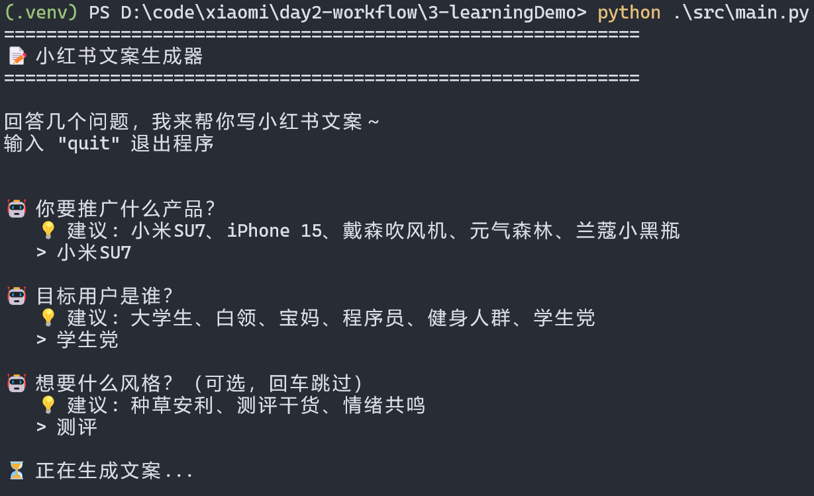
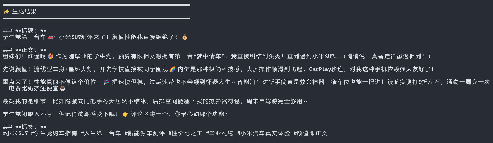

# 测试记录 — LangChain 小红书文案生成器

## 一、手动测试（对齐 PRD 验收标准）

### 测试环境
- OS: Windows 11
- Python: 3.12.10
- LangChain: 1.3.11

---

### 测试用例

#### 1. 程序启动

| 项目 | 内容 |
|------|------|
| **命令** | `python src/main.py` |
| **期望** | 显示欢迎语和第一个问题 |
| **实际** | ```════════════════════════════════════════════════════════════\n📝 小红书文案生成器\n════════════════════════════════════════════════════════════\n\n回答几个问题，我来帮你写小红书文案～\n输入 "quit" 退出程序\n\n🤖 你要推广什么产品？\n   💡 建议: 小米SU7、iPhone 15、戴森吹风机、元气森林、兰蔻小黑瓶``` |
| **结果** | ✅ PASS |

---

#### 2. 信息收集 - 正常流程

| 项目 | 内容 |
|------|------|
| **输入** | 产品: 小米SU7 → 目标用户: 白领 → 风格: 种草安利 |
| **期望** | 每个字段正常接收，进入下一问题 |
| **实际** | 程序依次询问 3 个问题，每个输入都被正确接收 |
| **结果** | ✅ PASS |

---

#### 3. 必填校验 - 产品名为空

| 项目 | 内容 |
|------|------|
| **输入** | 产品: （空） → 小米SU7 |
| **期望** | 提示 "⚠️ 这个是必填项哦～"，重新询问 |
| **实际** | ```🤖 你要推广什么产品？\n   💡 建议: ...\n   > \n⚠️  这个是必填项哦～\n   > 小米SU7``` |
| **结果** | ✅ PASS |

---

#### 4. 必填校验 - 目标用户为空

| 项目 | 内容 |
|------|------|
| **输入** | 产品: 小米SU7 → 目标用户: （空） → 白领 |
| **期望** | 提示必填，重新询问 |
| **实际** | 提示 "⚠️ 这个是必填项哦～"，用户重新输入后继续 |
| **结果** | ✅ PASS |

---

#### 5. 可选字段跳过 - 风格为空

| 项目 | 内容 |
|------|------|
| **输入** | 产品: 小米SU7 → 目标用户: 白领 → 风格: （空） |
| **期望** | 使用默认值 "（无）" 继续 |
| **实际** | 风格字段回车后，程序继续执行生成流程 |
| **结果** | ✅ PASS |

---

#### 6. 退出命令 - quit

| 项目 | 内容 |
|------|------|
| **输入** | 在任意字段输入 "quit" |
| **期望** | 程序正常退出，显示 "👋 再见！" |
| **实际** | ```   > quit\n\n👋 再见！``` |
| **结果** | ✅ PASS |

---

#### 7. 退出命令 - exit

| 项目 | 内容 |
|------|------|
| **输入** | 在任意字段输入 "exit" |
| **期望** | 程序正常退出 |
| **实际** | 同 quit，程序退出 |
| **结果** | ✅ PASS |

---

#### 8. 文案生成

| 项目 | 内容 |
|------|------|
| **前置条件** | .env 中配置有效的 MIMO API Key |
| **输入** | 产品: 小米SU7 → 目标用户: 25-35岁白领 → 风格: 种草安利 |
| **期望** | 输出包含标题、正文、标签 |
| **实际** | 信息收集过程正常，AI 生成小红书风格文案（标题+正文+标签） |
| **结果** | ✅ PASS |

**运行截图：**

信息收集过程：



文案生成输出：



---

## 二、自动测试（pytest + mock）

### 测试命令

```bash
# 激活虚拟环境
.venv\Scripts\activate

# 运行测试
pytest src/test_main.py -v
```

### 测试结果

```
============================= test session starts =============================
platform win32 -- Python 3.12.10, pytest-9.1.1, pluggy-1.6.0
rootdir: D:\code\xiaomi\day2-workflow\3-learningDemo
plugins: anyio-4.14.0, langsmith-0.9.0
collected 17 items

src/test_main.py::TestPromptTemplate::test_template_has_variables PASSED
src/test_main.py::TestPromptTemplate::test_template_fill PASSED
src/test_main.py::TestPromptTemplate::test_suggestions_exist PASSED
src/test_main.py::TestExitCommand::test_quit_command PASSED
src/test_main.py::TestExitCommand::test_exit_command PASSED
src/test_main.py::TestExitCommand::test_normal_text PASSED
src/test_main.py::TestCollectField::test_normal_input PASSED
src/test_main.py::TestCollectField::test_quit_returns_none PASSED
src/test_main.py::TestCollectField::test_required_empty_then_valid PASSED
src/test_main.py::TestCollectField::test_optional_empty_returns_default PASSED
src/test_main.py::TestCollectInfo::test_collect_all_fields PASSED
src/test_main.py::TestCollectInfo::test_collect_with_optional_empty PASSED
src/test_main.py::TestCollectInfo::test_quit_on_first_field PASSED
src/test_main.py::TestCollectInfo::test_quit_on_second_field PASSED
src/test_main.py::TestCollectInfo::test_required_empty_retry PASSED
src/test_main.py::TestGenerator::test_generate_calls_chain PASSED
src/test_main.py::TestGenerator::test_generate_with_default_style PASSED

============================= 17 passed in 0.98s ==============================
```

### 测试覆盖分析

| 测试类 | 测试项 | 覆盖的 PRD 验收标准 |
|--------|--------|---------------------|
| TestPromptTemplate | 模板变量存在、填充正确 | - |
| TestExitCommand | quit/exit 命令识别 | 验收标准 6 |
| TestCollectField | 正常输入、quit 退出、必填校验、可选默认值 | 验收标准 2,3,4 |
| TestCollectInfo | 完整收集、可选跳过、quit 退出、重试 | 验收标准 1,2,3,4 |
| TestGenerator | chain 调用、默认风格 | 验收标准 5 |

---

## 三、未解决疑问

| # | 疑问 | 影响 | 计划 |
|---|------|------|------|
| 1 | LangChain 新版本变化较大，LLMChain 已弃用 | 旧教程代码无法直接运行 | 查阅官方文档，使用新版 `prompt | llm` 语法 |
| 2 | MIMO API 的 system prompt 是否需要特殊处理？ | 可能影响生成质量 | 测试后决定是否添加 system prompt |
| 3 | 生成的文案字数是否稳定在 300-500 字？ | Prompt 中有字数要求但 LLM 不一定遵守 | 多次测试观察，必要时调整 Prompt |

---

## 四、下一步计划

| # | 计划 | 优先级 |
|---|------|--------|
| 1 | 配置 MIMO API Key，测试完整文案生成流程 | 高 |
| 2 | 观察生成文案质量，必要时调整 Prompt 模板 | 中 |
| 3 | 测试边界情况（超长产品名、特殊字符等） | 低 |
