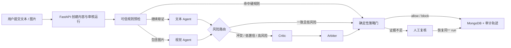

<div align="center">
  
  <h1>LOOPS</h1>
  <p><strong>可解释、可恢复、有人类最终控制权的双路线 AI 内容审核系统</strong></p>
  <p>由 ChinyenZoo 独立重构与维护的个人开源项目</p>
  <p><code>Day5 Submission</code> · <code>LOOPS</code></p>

  <p>
    
    
    
    
    
  </p>
</div>


LOOPS 解决的不是“让大模型给内容贴一个标签”，而是更难也更真实的问题：当规则、文本语义、图片证据和模型判断互相冲突时，系统如何给出可追溯的结论，如何限制模型权限，以及如何在证据不足时安全地交给人工。

项目保留传统 ML 流水线的速度优势，同时用 LangGraph 构建复杂内容的深度审核 Agent。模型负责结构化取证，确定性策略门负责自动裁决；冲突、低置信、缺失必要证据或外部模型故障都会进入可恢复的人工复核。

## 界面预览


控制台提供 Agent、机器学习和双方案对比三种视图，展示审核趋势、裁决分布、高风险队列、判断流水线与数据来源。页面中的 KPI 是确定性演示快照，不是生产跑分。

## 核心能力

- **双路线审核**：ML 处理稳定、低风险、高吞吐场景；Agent 处理复杂图文、冲突与高风险内容。
- **结构化证据**：文本、视觉、规则、质疑和仲裁节点统一输出可校验的 `Evidence`。
- **权限隔离**：LLM 不能仅凭输出 `HARD_BLOCK_*` 获得硬拦截权，策略门同时校验政策代码与可信来源。
- **条件式编排**：简单内容走快速路径；只有冲突、低置信、高风险或模型不可用时才触发 critic/arbiter。
- **人工复核闭环**：LangGraph `interrupt()` 暂停运行，人工决定通过同一 `run_id/thread_id` 恢复。
- **运行可追溯**：MongoDB 保存内容、Agent run、checkpoint、结构化轨迹与演示快照。
- **演示可降级**：Mongo 快照、后端确定性数据和前端本地副本采用同一协议，外部服务不可用时仍能诚实演示。

## 系统设计



设计细节、数据契约与失败策略见 [端到端系统设计](docs/design/end-to-end-system-design.md)。

## 快速开始

### 环境要求

- Docker Desktop
- Python 3.11 或更高版本
- Node.js 20 或更高版本
- npm

### 一键启动

```bash
git clone <你的仓库地址>
cd <仓库目录>
cp src/backend/.env.example src/backend/.env
./start.sh
```

启动完成后访问：

- Web 控制台：<http://127.0.0.1:5173>
- FastAPI 文档：<http://127.0.0.1:8008/docs>
- 健康检查：<http://127.0.0.1:8008/health>

`start.sh` 会依次准备 MongoDB、轻量 Python 环境、FastAPI 与 Vite。首次启动需要下载依赖。

### 配置云模型

编辑 `src/backend/.env`：

```dotenv
MODERATION_APPROACH=llm_api
MONGODB_URL=mongodb://localhost:27017
MONGODB_DB_NAME=loops_moderation

ARK_BASE_URL=https://ark.cn-beijing.volces.com/api/v3
ARK_API_KEY=
AGENT_TEXT_MODEL=deepseek-v4-flash-260425
AGENT_VISION_MODEL=doubao-seed-2-0-lite-260428
AGENT_CRITIC_MODEL=deepseek-v4-flash-260425
AGENT_ARBITER_MODEL=deepseek-v4-flash-260425
```

不要提交真实密钥。没有云模型密钥时，控制台仍可使用明确标注的演示快照，但真实 Agent 取证不可用。

### 生成演示数据

```bash
cd src/backend
.venv/bin/python seed_demo_data.py
```

该命令会清空本地演示数据库中的对应集合，请勿对生产数据库执行。

## Demo 主路径

1. 打开“指标看板”，查看 Agent 六阶段审核流水线与高风险队列。
2. 切换“机器学习方案”，观察固定流水线的低延迟定位。
3. 切换“双方案对比”，解释为何复杂内容需要 Agent、稳定流量适合 ML。
4. 切换 1 小时、24 小时和 7 天，确认数据源标签。
5. 进入“动态流”，提交正常文本、提示注入文本或带图片内容。
6. 对进入 `waiting_human` 的运行执行人工 `approve/reject`，验证同一 run 恢复。

完整讲解与失败预案见 [现场演示指南](docs/defense/demo_guide.md)。

## 验证

后端 Agent 测试：

```bash
cd src/backend
.venv/bin/python -m pytest tests/agents -q
```

前端质量检查：

```bash
cd src/frontend
npm run lint
npm run build
```

验证范围覆盖正常、边界、失败、安全回归、API 权限边界与端到端启动。实际执行记录见 [用例与结果](docs/validation/cases-and-results.md)。

## API 摘要

| 方法 | 路径 | 用途 |
|---|---|---|
| `POST` | `/api/posts/` | 创建内容并启动审核 |
| `GET` | `/api/moderation/runs/{run_id}` | 查询对用户安全的运行状态 |
| `GET` | `/api/moderation/runs/{run_id}/trace` | 获取管理侧结构化轨迹 |
| `POST` | `/api/moderation/runs/{run_id}/human-decision` | 提交人工决定并恢复运行 |
| `GET` | `/api/metrics/control-center` | 获取 Agent/ML 控制台数据 |
| `GET` | `/health` | 服务与 MongoDB 健康状态 |

## 项目结构

```text
.
├── README.md                  # 项目总览、运行与验证入口
├── src/
│   ├── backend/               # FastAPI、LangGraph、MongoDB、规则与 ML
│   └── frontend/              # React 控制台、动态流与人工复核界面
├── prototype/
│   ├── prototype-readme.md    # 原型能证明与不能证明什么
│   ├── screenshots-or-video.md
│   └── assets/                # Logo、原创头图与真实运行截图
├── docs/
│   ├── diagnosis/             # 问题诊断、澄清问题、假设与非目标
│   ├── options/               # 三条方案、取舍矩阵、拒绝项
│   ├── decision/              # 决策备忘与最终建议
│   ├── design/                # 端到端架构、数据流与失败策略
│   ├── validation/            # 计划、用例结果、边界风险与 Review
│   ├── ai/                    # AI 协作记录与采纳/拒绝清单
│   ├── collaboration/         # 责任、同步、决策与问题日志
│   ├── reflection/            # 维护者复盘与个人贡献
│   └── defense/               # 六分钟演示与现场兜底
├── CONTRIBUTING.md            # 贡献流程
├── SECURITY.md                # 漏洞报告与密钥处理
├── CODE_OF_CONDUCT.md         # 社区行为准则
└── LICENSE                    # MIT License
```

文档不是装饰。每个关键判断都应沿“问题 → 澄清 → 方案 → 决策 → 实现 → 测试 → Review”追溯，证据索引见 [证据映射](docs/evidence-map.md)。

## 已知限制

- ML 与 Agent 已分别实现，但统一的在线风险分流入口尚未接通。
- 当前任务队列是单进程实现，不具备跨实例租约、幂等与分布式消费能力。
- 管理侧 trace 与人工决定接口尚未接入正式 RBAC。
- 没有正式标注集、漂移监控、政策版本和生产 SLO，不能声明生产准确率。
- 云模型的可用性、延迟和费用取决于外部服务。
- Vite 生产构建仍有主包体积告警，后续需要路由级拆包。

## 参与贡献

欢迎提交问题、改进文档、补充测试或实现小范围功能。开始前请阅读 [贡献指南](CONTRIBUTING.md) 与 [行为准则](CODE_OF_CONDUCT.md)。安全问题请按 [安全策略](SECURITY.md) 私下报告，不要在公开 Issue 中披露密钥或可利用细节。

## 许可证

本项目使用 [MIT License](LICENSE)。

---

<div align="center">
  <sub>Designed, rebuilt and maintained by ChinyenZoo.</sub>
</div>
