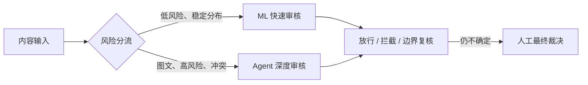
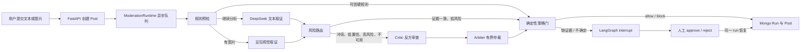

# 端到端系统设计

## 为什么采用双路线

ML 流水线的优势是固定、快速、便宜；Agent 的优势是多模态语境、结构化证据、冲突复核和可恢复状态。把所有内容都交给 Agent 会放大延迟和成本，把所有内容都交给 ML 又难以解释复杂图文。因此最终设计把二者视为不同风险层的能力，而不是互相替代。



当前代码已经分别实现 ML 和 Agent 两条能力，但“ML 先筛、Agent 再升级”的统一在线路由仍是最终演进建议；本轮演示通过看板对比和各自入口说明它们的取舍，不把尚未接线的统一路由写成已完成。

## Agent 主数据流



## 状态与数据契约

`ModerationState` 包含 `run_id`、`post_id`、文本、图片路径、assessments、trace、路由原因、仲裁结果、最终 decision 和人工决定。并行节点通过 reducer 合并 assessment 与 trace。

`Evidence` 只保存证据 ID、来源、类别、严重度、置信度、摘要、政策代码、文本片段、图片区域、模型名、提示版本和耗时，不保存隐藏思维链。

运行状态：

```text
queued → running → completed
                 ↘ waiting_human → queued → running → completed
                 ↘ failed
```

## 模块与接口

| 层 | 模块 | 职责 |
|---|---|---|
| 模型协议 | `agents/ark.py` | 方舟 Responses API、重试、结构校验、图片 data URL |
| 专家 | `agents/moderators.py` | 文本、视觉、critic、arbiter |
| 工具 | `agents/tools.py` | 把旧规则引擎转换为结构化可信证据 |
| 编排 | `agents/graph.py` | 节点、并行、条件路由、interrupt |
| 裁决 | `agents/policy.py` | 可信来源、必要证据、最终自动决策 |
| 运行 | `agents/runtime.py` | 异步队列、失败记录、恢复 |
| 持久化 | `agents/repositories.py` | 内存测试仓储和 Mongo run 仓储 |
| API | `api/posts.py`、`api/agent_moderation.py` | 入队、状态、轨迹、人工决定 |

主要 API：

- `POST /api/posts/`：创建 Post；Agent 模式立即返回 run ID。
- `GET /api/moderation/runs/{run_id}`：用户状态，排除原文与内部 trace。
- `GET /api/moderation/runs/{run_id}/trace`：结构化管理轨迹。
- `POST /api/moderation/runs/{run_id}/human-decision`：恢复等待人工的运行。
- `GET /api/metrics/control-center`：双方案看板快照。

## 权限与失败取舍

- 只有 `rule` 和 `attack_tool` 来源的 `HARD_BLOCK_*` 才能短路。
- LLM 伪造同名政策代码不会获得硬权限。
- 图片存在时，`vision_agent` 是必要证据源；不可用则转人工。
- 模型非法结构有限重试；明确不支持 JSON Schema 时降级 JSON 对象，之后仍做 Pydantic 校验。
- Graph 未产生 decision 时标记 failed，不默认 allow。
- 进程启动时重新排队 `queued/running` run；人工恢复使用原 run ID。

## 看板数据设计

Mongo `dashboard_snapshots` 保存 1、24、168 小时确定性快照。后端无快照时使用同结构内置数据，前端接口失败时再使用本地副本。三层数据协议一致，确保演示不因网络中断空白；页面必须展示数据源标签，避免把回退数据误解为实时生产数据。

## 未完成的生产能力

- ML 与 Agent 的统一在线风险路由尚未接成一个入口；
- 单进程队列没有分布式租约与跨实例幂等；
- Trace 和人工接口缺管理员鉴权；
- 没有正式政策版本、标注集、漂移监控和生产 SLO。
