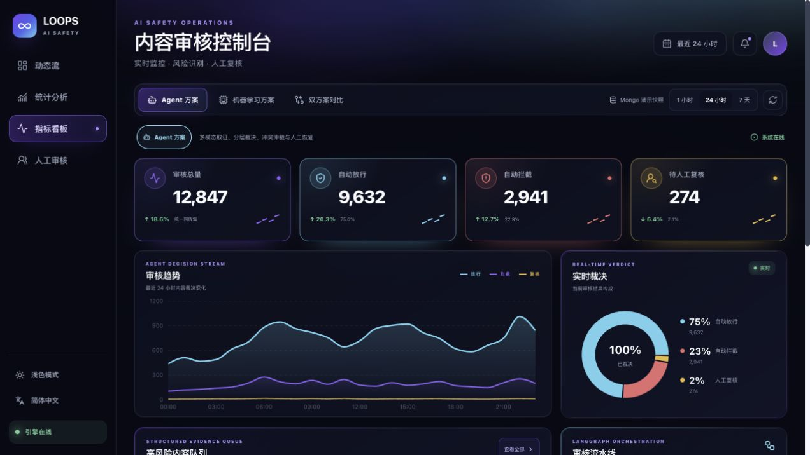
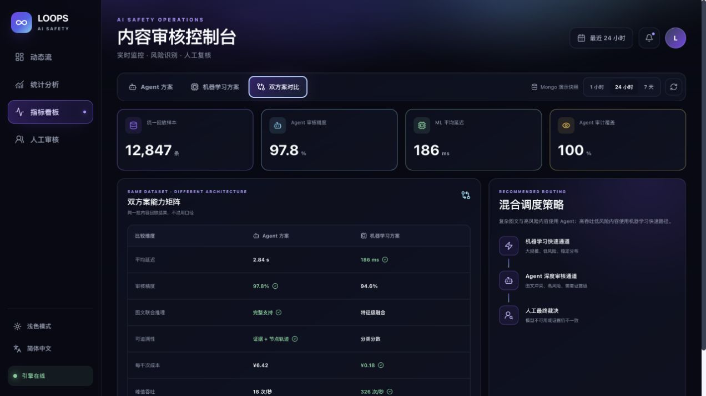

# 截图与演示证据

## 项目视觉

原创头图用于表达“规则取证 → Agent 分析 → 人工复核 → 策略裁决”的闭环，不代表真实运行界面。

## Agent 方案 24 小时视图

该截图证明默认页面已围绕 Agent 审核运营组织，包含 KPI、趋势、实时裁决、高风险队列、审核流水线与数据源标签。

## 架构对比视图

对照截图用于复核侧栏、标题层级、KPI 网格、趋势图、风险队列、流水线与双方案切换。

## 已验证交互

- Agent、机器学习、双方案三个架构视图；
- 1 小时、24 小时、7 天三个时间范围；
- Mongo 演示快照来源标签；
- 1280 × 720 视口无横向溢出；
- 关键页面控制台无 error/warn。

当前仓库不提交录屏文件；现场演示步骤见 `docs/defense/demo_guide.md`。
